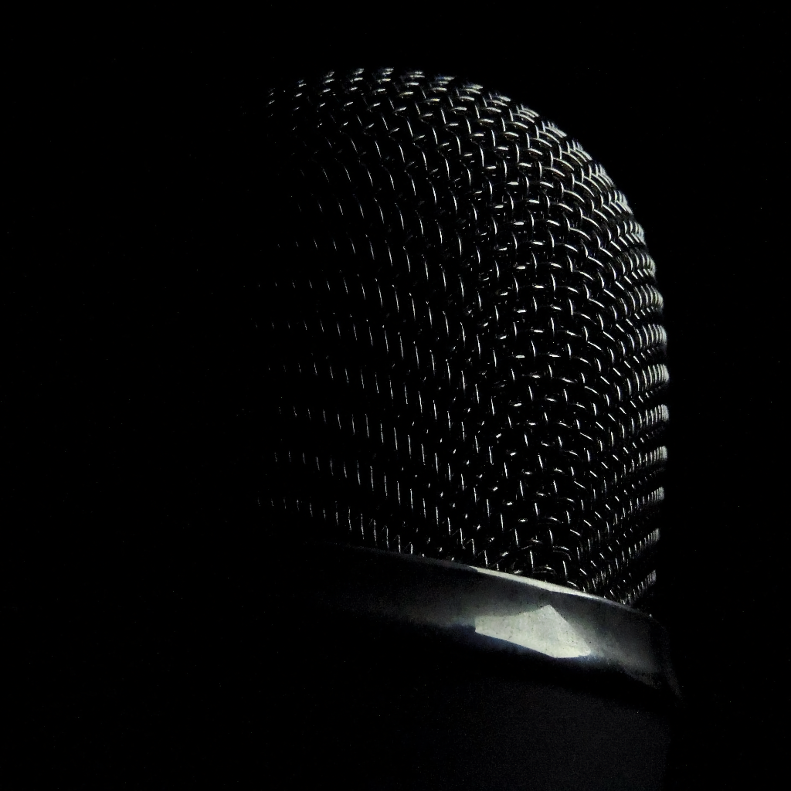

<p align="center">
  
</p>

# Stem

A native macOS app for audio stem separation — isolate vocals, drums, bass, and other instruments from any song using state-of-the-art deep learning, running entirely on Apple Silicon GPU.


## Features

- **Drag & drop** any audio file (MP3, WAV, AIFF, M4A)
- **GPU-accelerated** separation via [MLX](https://github.com/ml-explore/mlx-swift) on Apple Silicon (Metal)
- **htdemucs_ft** model — Meta's fine-tuned Hybrid Transformer Demucs, state-of-the-art quality
- **4 stems**: vocals, drums, bass, other instruments
- **Synchronized multi-track playback** — all stems play in lock-step via `AVAudioEngine` with sample-accurate sync
- **Mute / Solo / Volume** per stem — instant karaoke: mute the vocals and sing along
- **Waveform visualization** with real-time playback progress and click-to-seek
- **MP3 export** — single stem or batch export to a folder (VBR V2, ~190 kbps via libmp3lame)
- **Adaptive memory management** — MLX Metal cache is capped at 70% of available system memory; model and buffers are released after separation
- **Streaming audio analysis** — waveform peaks computed in small chunks, no full-buffer allocation
- **Zero Python** — pure Swift/C, no Python runtime or conversion tools needed
- **Automatic model download** — weights (~336 MB) are fetched from HuggingFace on first run

## Requirements

- macOS 26 or later
- Apple Silicon (M1 or later)
- Xcode 26+

## Build

### 1. Clone

```bash
git clone https://github.com/thierrylebris/Stem.git
cd Stem
```

### 2. Build libmp3lame

The MP3 export feature requires a locally compiled static library. No system-wide installation — everything stays inside the repo.

```bash
./Scripts/fetch_lame.sh    # Download LAME 3.100 sources (~1.5 MB)
./Scripts/build_lame.sh    # Compile static lib for arm64
```

This produces `ThirdParty/lame/lib/libmp3lame.a` and headers in `ThirdParty/lame/include/`.

### 3. Build & Run

Open `Stem.xcodeproj` and press **Cmd+R**. The LAME build settings are provided by `Lame.xcconfig` (automatically referenced by both Debug and Release configurations).

On first launch, the app will download the htdemucs_ft model weights (~336 MB) from HuggingFace.

> **Tip:** To pre-download the model weights (useful for offline builds or CI):
> ```bash
> ./Scripts/fetch_models.sh
> export DEMUCS_MLX_SWIFT_MODEL_DIR=$(pwd)/Models
> ```

> **Note:** If running from Xcode with Metal API Validation enabled, you may see a debug assertion from MLX's Metal resource management. This is a known upstream issue that does not affect functionality. Disable Metal API Validation in **Edit Scheme → Run → Diagnostics** to avoid the crash in debug builds.

## Architecture

```
Stem/
├── StemApp.swift                  App entry point, window configuration
├── AppState.swift                 Observable state machine (idle → loading → loaded → processing → done/failed)
├── ContentView.swift              Phase router
├── AudioIO/
│   ├── AudioDecoder.swift         Streaming audio analysis: waveform peaks in 16K-frame chunks
│   ├── MP3Encoder.swift           PCM → MP3 encoding via libmp3lame (single + batch export)
│   ├── StemPlayer.swift           AVAudioEngine multi-track player: mute, solo, volume, sample-accurate sync
│   └── lame-bridge.h              Bridging header for libmp3lame
├── Separation/
│   └── SeparationPipeline.swift   DemucsMLX integration, adaptive memory limits, WAV output
├── Waveform/
│   └── WaveformView.swift         Canvas-based symmetric waveform with playback indicator
└── UI/
    ├── DropZoneView.swift          Drag & drop landing zone
    ├── LoadingView.swift           Audio analysis progress
    ├── LoadedView.swift            Waveform preview + "Separate" action
    ├── ProcessingView.swift        Separation progress bar
    ├── ResultView.swift            Transport bar, per-stem controls (mute/solo/volume), batch export
    └── FailureView.swift           Error display with retry
```

### Dependencies

| Dependency | Role | Source |
|-----------|------|--------|
| [demucs-mlx-swift](https://github.com/kylehowells/demucs-mlx-swift) | Demucs inference via MLX | SwiftPM (product: `DemucsMLX`) |
| [MLX-Swift](https://github.com/ml-explore/mlx-swift) | GPU compute on Apple Silicon | Transitive via demucs-mlx-swift |
| [LAME](https://lame.sourceforge.io/) 3.100 | MP3 encoding | Static lib compiled locally |

### Model

**htdemucs_ft** (Hybrid Transformer Demucs, fine-tuned) — Meta's state-of-the-art music source separation model. Weights are in fp16 safetensors format, automatically downloaded from [HuggingFace](https://huggingface.co/iky1e/demucs-mlx) on first use.

Performance: ~73× realtime on M4 Max, ~15-25× on M1 Pro (varies with track length and memory pressure).

## Usage

1. Launch the app
2. Drag an audio file onto the window
3. Preview the waveform, then click **Séparer les stems**
4. Wait for separation (progress bar shown)
5. Play all stems in sync — use **mute**, **solo** (S), and **volume** sliders to mix
6. Export a single stem as MP3, or click **Tout exporter** for all stems at once

## License

MIT — see [LICENSE](LICENSE).

The htdemucs_ft model weights are subject to Meta's [license terms](https://github.com/facebookresearch/demucs/blob/main/LICENSE).
